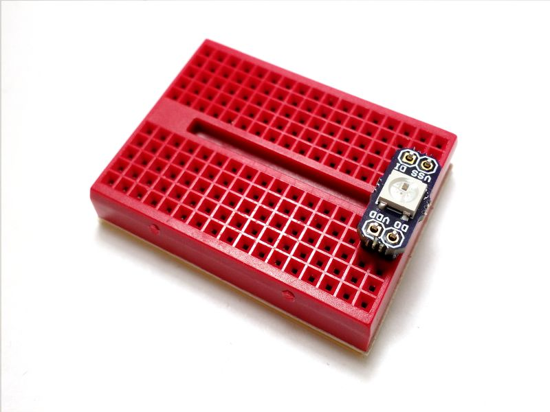

# eeZeeRGB User Guide
The WS2812B is the latest smart RGB module with onboard microcontroller and now it's easy to breadboard it, thanks to eeZeeRGB.

Want one? [Buy now on Tindie](https://www.tindie.com/products/bot_thoughts/eezee-rgb-led/).

## Quick Start

* Install pin headers (see *How to Assemble* below)
* ```VDD``` to 5V, 60mA/module
* ```VSS```/```GND``` to ground
* ```DIN``` to microcontroller
* ```DOUT``` to next module's ```DIN``` (optional)
* Write code (see *Quick Start Coding Guides* below)

## How to Assemble

Assembly is easy. And, you can learn how to solder at the same time. Review [Sparkfun's Soldering Tutorial](https://learn.sparkfun.com/tutorials/how-to-solder---through-hole-soldering) if you need to. Here's a helpful info-graphic from the tutorial:


### You'll need
* Soldering iron, 40W
* Sponge to clean the iron (I recommend a brass sponge)
* Workbench with plenty of light
* Ventilation since breathing flux fumes is irritating
* Soldering surface (e.g., marble tile sample)
* Rosin core solder 0.022” or 0.032” diameter
* Kester #2331-ZX flux pen (optional)

### Pin headers

Install pin headers into a breadboard, spaced 5 rows apart.


Place eeZeeRGB onto the pin headers.



Solder the pin headers in place.

### Cleanup

You'll want to remove the rosin and flux

I usually just use isopropyl alcohol and an old toothbrush

You can also buy chemicals specifically for removing flux and rosin


## Use

  * Connect ```VDD``` to 5V capable of driving 60mA per module
  * Connect ```VSS``` (or ```GND```) to ground
  * Connect ```DIN``` to a pin on your microcontroller

### Communicating with 3.3V Devices

  * Care should be taken with 3.3V devices.
  * Use 5V tolerant pins or a level shifter.
  * The 10K pull-up resistor on ```DIN``` ensures correct logic levels.
  * This resistor limits current through 3.3V device clamping diodes.
  * Parallax Propeller can tolerate this current.

### Current Draw

I recommend conservatively estimating a maximum 61mA per board, 60mA for the module and 1mA for the pull-up resistor.

Adafruit has a good [power supply guide](https://learn.adafruit.com/adafruit-neopixel-uberguide/power) available.

Each board has a 10K pull-up resistor (5% tolerance) plus regulator variation (say 10% to be safe), so 0.8mA per board  with a bit extra margin just in case. Round up to 1mA to be really safe.

Your GPIO pin should only see 1mA through the first module's pull-up when pulling down DIN.

### Connecting additional RGB modules

  * Connect ```VDD``` and ```GND``` as described above
  * Connect the first module's ```DIN``` to the microcontroller
  * Connect its ```DOUT``` to the next module's ```DIN```
  * Repeat for each module

## Quick Start Coding Guides

How do you write firmware to use the eeZeeRGB with your microcontroller? Read on...

### Arduino

  * Grab a copy of the [Adafruit NeoPixel Library](http://github.com/adafruit/Adafruit_NeoPixel/)
  * Follow instructions at the link above to install the NeoPixel library
  * Find my [example code here](https://github.com/shimniok/eeZeeRGB/tree/master/examples/Arduino_WS2812)
  * Connect DIN to Arduino D8
  * Compile and download the firmware to your Arduino

### ATtiny

  * Grab a copy of the Light [WS2812 library](https://github.com/cpldcpu/light_ws2812)
  * Find my [example code here](https://github.com/shimniok/eeZeeRGB/tree/master/examples/AVR_WS2812)
  * Use make to compile the example programs
  * Flash an example hex file to yourATtiny
  * Connect PB1 to DI on the eeZee RGB
  * To change pins, ports, edit ws2812\_config.h and re-make

### Propeller

You can find a WS2812B driver [here](https://www.parallax.com/downloads/ws2812b-rgb-led-module-propeller-spin-code). I have not tested the code myself.

### mbed

[Example](https://developer.mbed.org/users/bridadan/code/WS2812_Example/). I have not tested the code myself.

## Datasheet

[WS2812B\_preliminary.pdf](http://www.mikrocontroller.net/attachment/180459/WS2812B_preliminary.pdf)
